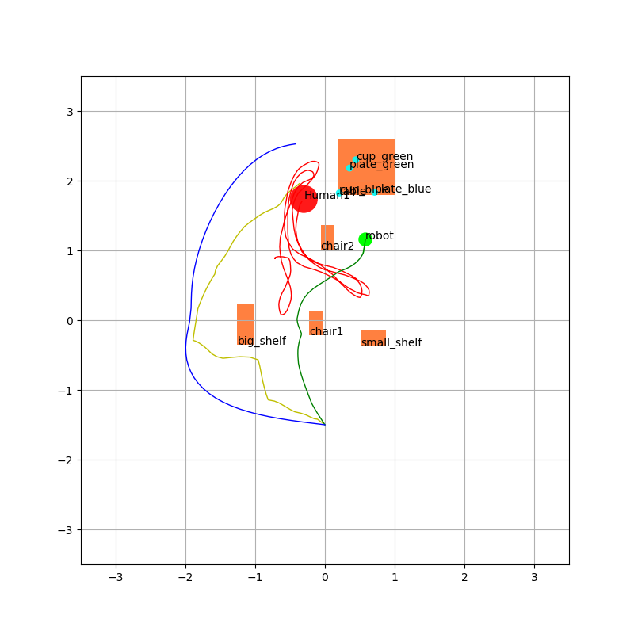

# GIL-LGP

This repo implement the Guided Imitation Learning for LGP. This framework devise a hierarchial policy to imitate the LGP solvers. An example of the resulting policy is shown in the following figure. The figure show the trajectories from different solver: red - huamn’s trajectories, yellow - GIL-LGP, blue - Single plan LGP, green - Dynamic plan
LGP.




This repo is built based on the repo of LGP from Le et al. [1]
## Installation
This assumes you a;ready install the dependencies for Simon's master thesis repo and `humoro`. 

Clone Simon's master thesis repo:

```bash
git clone git@animal.informatik.uni-stuttgart.de:simon.hagenmayer/hierarchical-hmp.git
```

Then, clone `humoro` and `gil` to `hierarchical-hmp` folder, checkout `MASimon` branch on `humoro`, install dependencies of `gil` and install `gil`:

```bash
cd hierarchical-hmp
git clone git@animal.informatik.uni-stuttgart.de:philippkratzer/humoro.git
git clone git@github.com:nkquynh98/gil.git
cd humoro
git checkout MASimon
cd ../gil
pip install -r requirements.txt
pip install -e .
```

Also clone `bewego` into `hierarchical-hmp` folder. We use the old version of Bewego as the newer version is now not compatible with the LGP:
```bash
cd hierarchical-hmp
git clone https://github.com/anindex/bewego --recursive
cd bewego
mkdir -p build && cd build
cmake .. -DCMAKE_BUILD_TYPE=RelWithDebInfo -DWITH_IPOPT=True -DPYBIND11_PYTHON_VERSION=3.5
make
make install
```

Finally, please download [MoGaze](https://humans-to-robots-motion.github.io/mogaze/) dataset and unzip it into `gil/datasets/mogaze`.
```bash
mkdir -p datasets && cd datasets
wget https://ipvs.informatik.uni-stuttgart.de/mlr/philipp/mogaze/mogaze.zip
unzip mogaze.zip
```

And also run this script to initialize Pepper URDF:

```
cd gil
python examples/init_pepper.py
```

## Usage

To generate an Expert task and motion dataset, please run:

```
python examples/dataset_generator.py
```
To train the task and motion policies, please run

```
python gil/policy/training/move_motion_training.py
python gil/policy/training/task_policy_training.py
```

To test the trained policies, please run this experiment:

```
python examples/experiment_with_gil.py
```

To read the experiment result, please run:
```
python examples/read_save_experiment.py
```

# References

[1] A. T. Le, P. Kratzer, S. Hagenmayer, M. Toussaint, and J. Mainprice,
“Hierarchical human-motion prediction and logic-geometric program-
ming for minimal interference human-robot tasks,” 2021 30th IEEE
International Conference on Robot and Human Interactive Communi-
cation, RO-MAN 2021, pp. 7–14, 4 2021